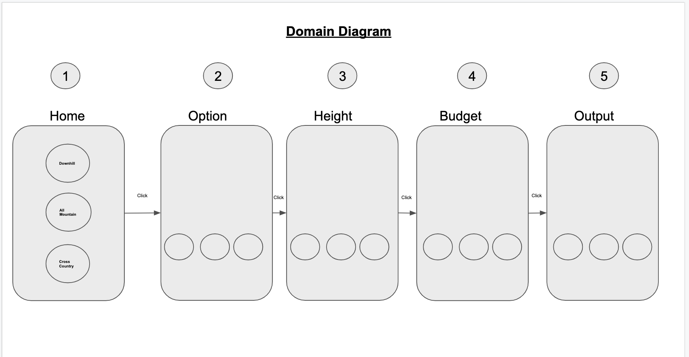
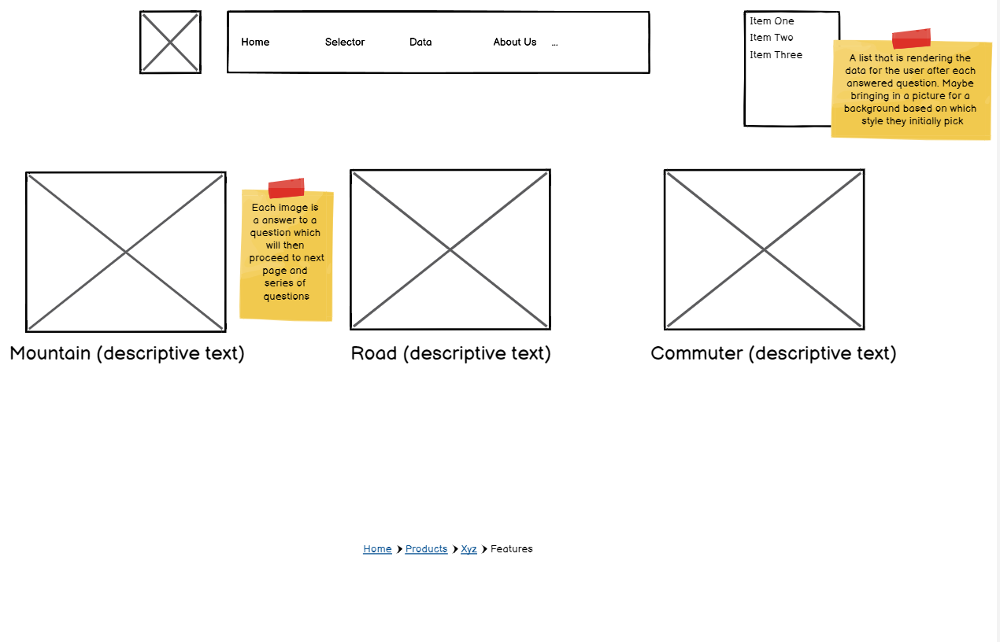
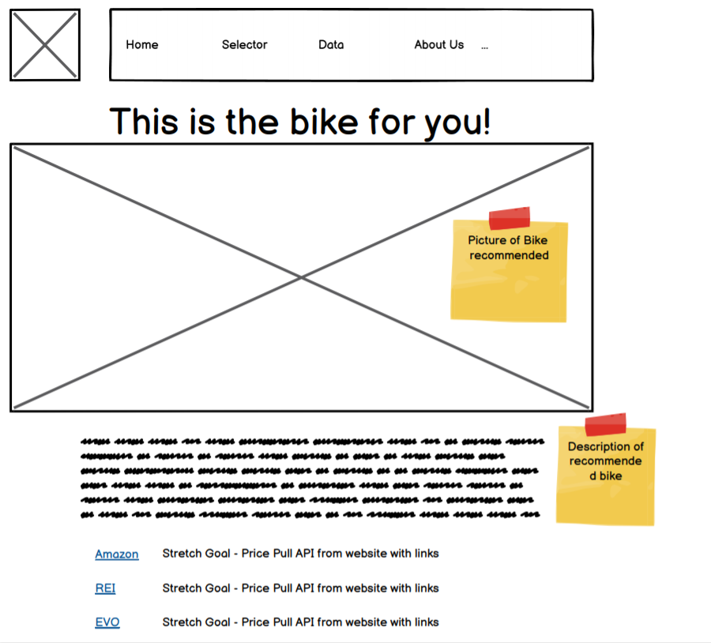
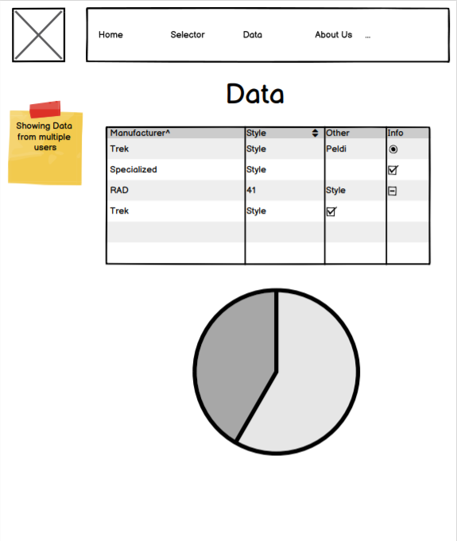
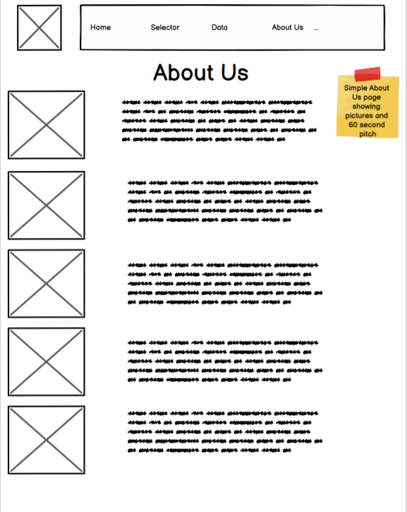

# The Bike Selector App

## Authors

- Lee Thomas
- Rolando Haynes
- Dominique Augurson
- Spencer Lazzar
- Taylor Johnson

## Description

An interactive web app designed to help individuals interested in cycling figure out what type of bike is the right fit for their intended use.

## Solution

Our app will provide users with a tiered interactive menu that will reducibly lead them to the correct bicycle for their riding intentions.
It will ask first for their intended terrain (road, mountain, park). Next it will refine that selection into sub-categories to land on the specialized bike configuration for their intended riding. The app will have a form for the user to input their height and inseam measurement. This information will be stored in local memory and run through script to produce the proper frame size for the user. The app will also have a drop down menu with a range of budgets to select from. Based on the combination of forms and selections, the final bike presentation page will display to the user what specific bike type is right for them, what size of frame and what kind of options to expect their budget.

## Work Cited

We used a google font from [GoogleFonts](https://fonts.google.com/)
We got our js delay from [stackoverflow](https://stackoverflow.com/questions/17883692/how-to-set-time-delay-in-javascript)

## Version Log

### 1.0.0

Project start. Basic layout and file organization. Creation of repo and branch structure.

### 1.1.0

In development. Still working out the JS code functionality. CSS has been roughly established. Added requirements. Added user stories. Enhanced README with domain modeling and wire-frame.

### 1.2.0

In development. First big merge of JS and CSS work. Lots of merge conflicts. Eventually reworked our CSS to agree with the JS more easily. Implemented flex box to position elements as desired.

### 1.3.0

Added pseudo selector functionality to javascript. User can now select an image that corresponds the desired option and see image change colors.

### 1.4.0

Finished JS logic to build bike objects and store them in local storage. Your bike page displays dynamic content based on user selections.

### 2.0.0

Improved readability of fonts. Many finishing touches to CSS. Fixed any file path issues for rendering images.

### 2.0.1

Last update to readme. Fixed missing images for domain diagrams.

## Domain Modeling

### Domain Diagram

## WireFrame

### Test Page

 

### Results Page

 

### Data Page

 

### About Us Page

